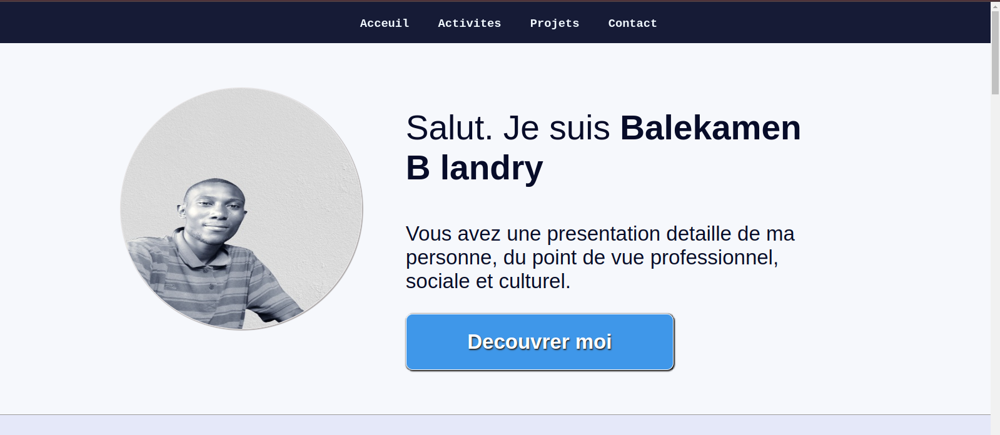
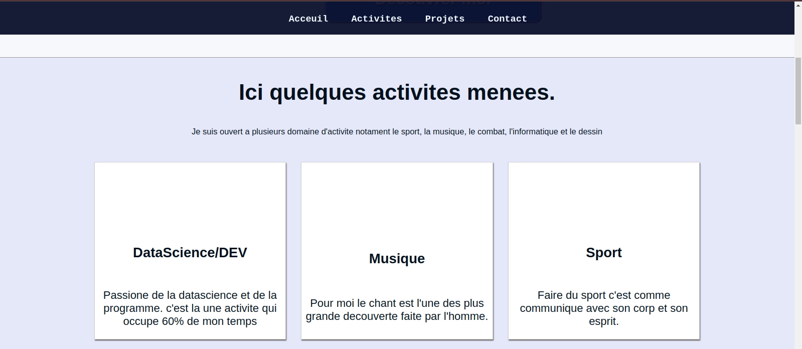
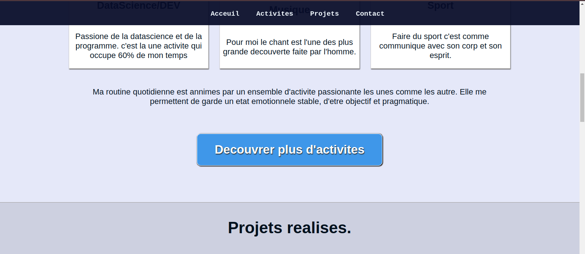
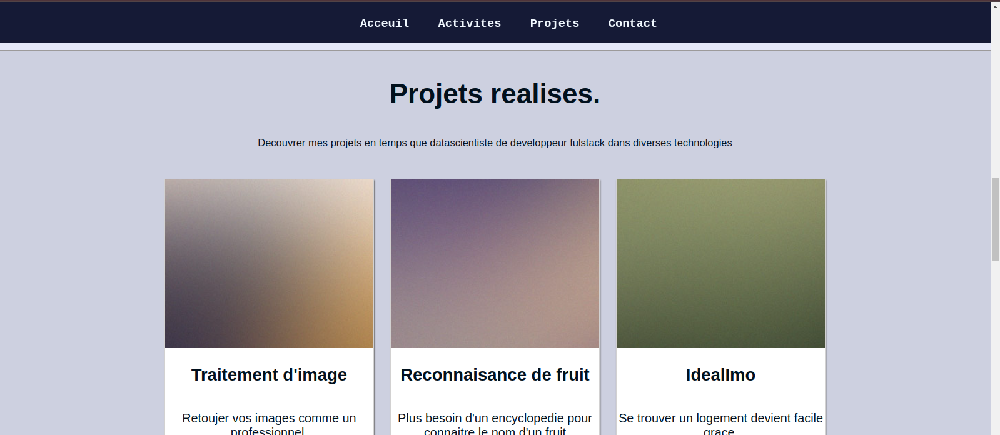
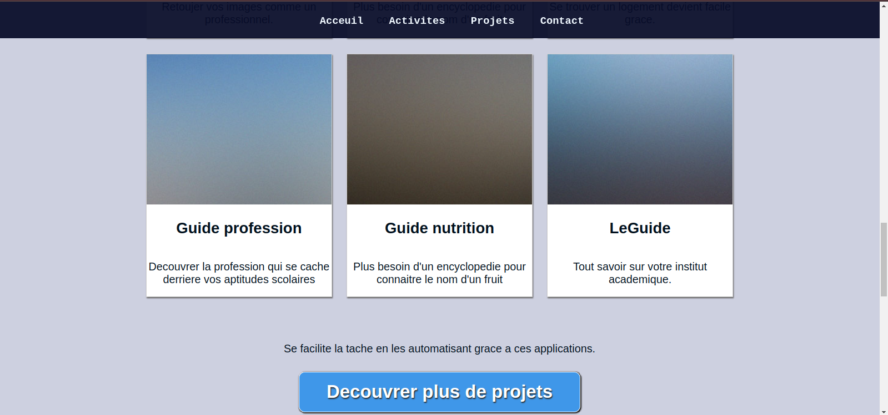
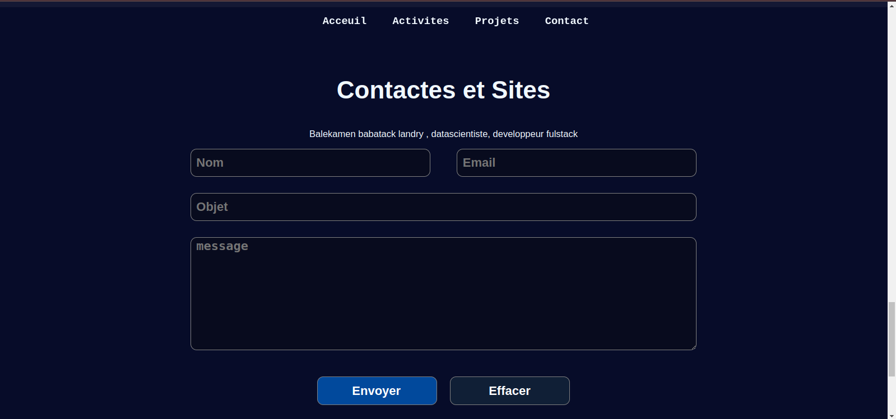

<h1 style="color:rgb(14, 233, 160);">Mini portofolio en html/css</h1>

petit site web permettant de se presenter et de presenter
ses activites, ses projets et sa carriere avec un formulaire de contact.

<h2 style="color:rgb(14, 233, 160);">Getting Started</h2>

Telecharger juste de dossier zipper puis decompresser le sur votre machine et 
ouvrer le fichier index.html a partir d'un navigateur 

<h2 style="color:rgb(14, 233, 160);">Prerequisites</h2>

Pour ouvrir l'index avec le navigateur vous aurai juste besoin d'un navigateur supportant html5/css3 :  
 - <strong>Navigateur </strong> 

<h2 style="color:rgb(14, 233, 160);">Image du site web</h2>

